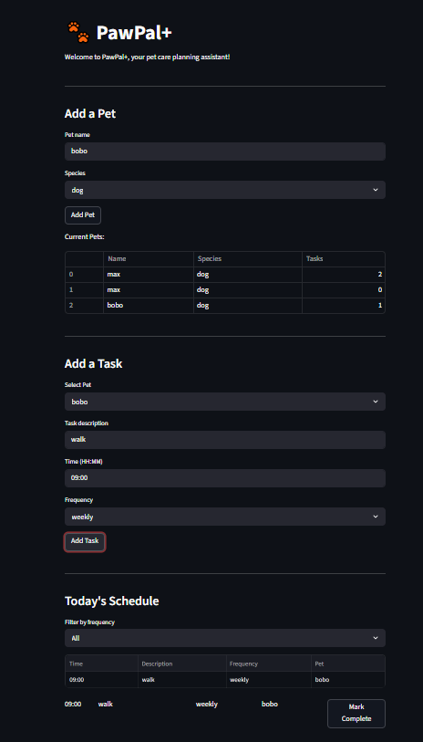
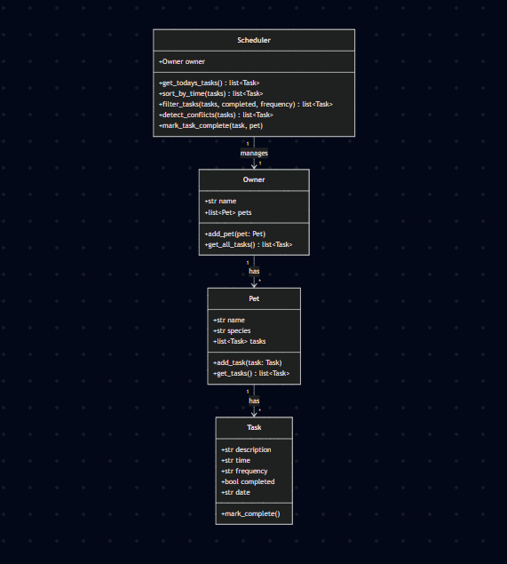

# PawPal+ (Module 2 Project)

**PawPal+** is a smart pet care management system that helps owners keep their furry friends happy and healthy. It tracks daily routines — feedings, walks, medications, and appointments — while using algorithmic logic to organize and prioritize tasks.

## Setup
```bash
python -m venv .venv
source .venv/bin/activate  # Windows: .venv\Scripts\activate
pip install -r requirements.txt
```

## Features

- **Pet Management**: Add pets with name and species, view all registered pets in a table
- **Task Scheduling**: Assign tasks to specific pets with description, time (HH:MM), and frequency (daily/weekly/once)
- **Smart Sorting**: Today's schedule is automatically sorted chronologically
- **Frequency Filtering**: Filter the schedule view by All, Daily, Weekly, or Once
- **Recurring Tasks**: Completing a daily or weekly task auto-generates the next occurrence
- **Conflict Detection**: Warnings appear when two tasks share the same time slot
- **Input Validation**: Prevents blank pet names, blank descriptions, and invalid time formats
- **Mark Complete**: Complete tasks directly from the UI with one click


## Smarter Scheduling

PawPal+ includes several algorithmic features that make task management intelligent:

- **Sort by Time**: Tasks are automatically sorted in chronological order using HH:MM parsing, so your morning routine appears before afternoon appointments.
- **Filter by Status/Frequency**: View only incomplete tasks, or filter by daily, weekly, or one-time tasks to focus on what matters.
- **Recurring Tasks**: When a daily or weekly task is marked complete, the system automatically generates the next occurrence using Python's timedelta — no manual re-entry needed.
- **Conflict Detection**: The scheduler scans for tasks scheduled at the same time and displays a warning, helping you avoid double-booking your pet's care.
## 📸 Demo



<a href="/course_images/ai110/image.png" target="_blank"></a>

## System Architecture (UML)



## Testing PawPal+

Run the test suite with:
```bash
python -m pytest
```

The tests cover:
- Task completion (mark_complete changes status)
- Task addition (adding a task increases pet's task count)
- Sorting correctness (tasks returned in chronological order)
- Recurrence logic (completing a daily task creates one for the next day)
- Conflict detection (duplicate times are flagged)

**Confidence Level:** ⭐⭐⭐⭐ (4/5) — Core logic is verified, but edge cases like overlapping durations and empty inputs aren't tested yet.